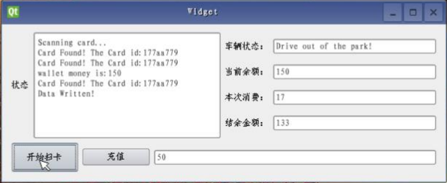

# Parking_Management_System
 Based on RFID 13.56MHz

Interface development using QT

Reader process:

1. Initialize the 13.56M card reader first
2. Try to read the card, because if the card is not read, it will issue read_ Error signal, which triggers oncarderror function, so this function is used to try to read the card again. This allows the card to be scanned continuously when no card is scanned.
3. After finding the card, send a signal, trigger the onfoundcard function, read out the card number and display it on the screen, and then read the content of block 2. In this experiment, it is assumed that the user's balance, vehicle access, access time and other data are stored in block 2
4. After reading the card, send a signal to trigger the onreadcard function to read the balance and other information in the card, According to the recharge flag (rechargestatus) judge whether to recharge. If the flag is 1, it indicates that recharge is required, and recharge the card according to the data in the recharge box. Otherwise, judge whether the vehicle enters the parking lot or leaves the parking lot according to the vehicle access sign. If it is considered that the vehicle needs to swipe the card into the parking lot, set the vehicle access sign, entry time, etc. if it is judged that the vehicle needs to leave the parking lot In the parking lot, set the vehicle exit sign, subtract the entry time from the current time to calculate the price (in this experiment, it is set to 1 yuan / s for demonstration convenience). Then deduct it from the balance. If the balance is insufficient, error will be displayed, and the administrator will prompt the user to recharge.

Demo screenshot:

